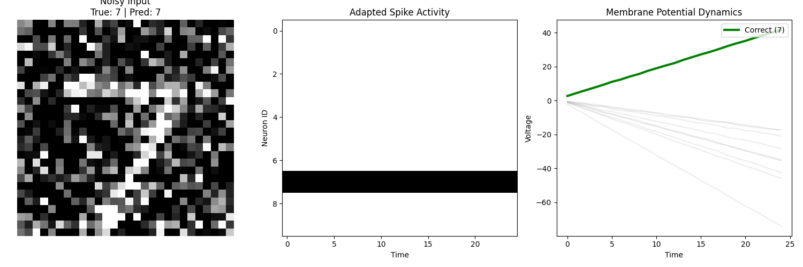

# Adaptive Temporal Dynamics in Spiking Neural Networks: Noise Robustness via Parametric Homeostasis

## Abstract
This project investigates the role of intrinsic neural plasticity in enhancing the robustness of Spiking Neural Networks (SNNs) against high-entropy sensory inputs. By implementing Parametric Leaky Integrate-and-Fire (PLIF) neurons with learnable membrane time constants ($\tau_m$), the model demonstrates an autonomous transition from a "leaky" regime to an "integrator" regime when subjected to severe Gaussian noise. The results suggest that modulating the temporal integration window is a critical mechanism for maintaining signal-to-noise ratio (SNR) in biological and artificial neural circuits.

## 1. Theoretical Background
Biological neurons are not static processing units; they exhibit heterogeneity and adapt their intrinsic properties—such as membrane resistance and capacitance—to match the statistics of their input currents. This form of adaptation, often termed **intrinsic homeostatic plasticity**, allows cortical circuits to maintain stability and information transmission capabilities across varying environmental conditions.

In standard SNN implementations, the membrane decay rate ($\beta$) is typically treated as a fixed hyperparameter. This imposes a rigid temporal integration window, which may be suboptimal for noisy inputs where evidence accumulation over longer timescales is required. This project relaxes this constraint by treating the membrane decay as a learnable parameter, optimized via surrogate gradient descent.

### Mathematical Formulation
The discrete-time dynamics of the membrane potential $V[t]$ for the $i$-th neuron in layer $l$ are governed by:

$$ V_i^{(l)}[t+1] = \beta_i \cdot V_i^{(l)}[t] + I_i^{(l)}[t] - S_i^{(l)}[t] \cdot V_{th} $$

Where:
*   $I[t]$ is the synaptic input current.
*   $S[t] \in \{0, 1\}$ is the spike output.
*   $\beta_i = e^{-\Delta t / \tau_{m,i}}$ is the decay factor, which determines the leakiness of the neuron.

Unlike standard models where $\beta$ is fixed (e.g., 0.9), here $\beta_i$ is a learnable parameter for each neuron layer, allowing the network to optimize its own integration timescale.

## 2. Methodology
The network was constructed using the `snnTorch` framework with the following specifications:

*   **Architecture:** A fully connected topology (784 input units $\rightarrow$ 128 hidden units $\rightarrow$ 10 output units).
*   **Plasticity Mechanism:** The decay rate $\beta$ was initialized at 0.9 and allowed to evolve during training alongside synaptic weights.
*   **Noise Protocol:** To simulate sensory uncertainty, additive Gaussian noise ($\mu=0, \sigma=0.5$) was injected into the input stimuli (MNIST) during both the training and inference phases. This intensity renders the input digits structurally degraded, necessitating robust temporal feature extraction.

## 3. Results and Discussion

The adaptive model was evaluated against a baseline static model (fixed $\beta=0.9$). The performance metrics indicate a significant divergence in system behavior under noise.

### Performance Comparison
*   **Static Model (Fixed $\beta$):** Failed to converge reliably (Accuracy: ~43%). The fixed leak term caused the rapid loss of weak signal information amidst the noise.
*   **Adaptive Model (Learnable $\beta$):** Achieved a classification accuracy of **86.39%**.

### Analysis of Neural Dynamics
A critical observation is the convergence behavior of the learned decay parameter. Starting from an initialization of 0.9, the parameter converged to approximately **1.006** during training.

This shift indicates a transition from a **Leaky Integrator** to a **Perfect Integrator** (or non-leaky integrator).
*   **Interpretation:** In a high-noise regime, the instantaneous input $I[t]$ is unreliable. By increasing $\beta$ towards 1 (effectively increasing $\tau_m \to \infty$), the neurons extended their temporal integration window. This allows the network to average out the zero-mean Gaussian noise over time, thereby recovering the underlying signal structure. This aligns with theoretical predictions regarding optimal integration strategies in low-SNR environments.

## 4. Visualization
The generated figure (`result.png`) displays the network state during the processing of a corrupted sample (Digit 7):
1.  **Input:** The noisy stimulus.
2.  **Raster Plot:** Shows the spike timing of the output layer. The network exhibits high selectivity, suppressing off-target neurons despite the noisy input.
3.  **Membrane Potential:** The trace for the correct class (Green) shows a linear accumulation of voltage without leakage, confirming the "Perfect Integrator" behavior.



## 5.📚 References
•	Eshraghian, J. K., et al. "Training Spiking Neural Networks Using Lessons From Deep Learning." Proceedings of the IEEE (2023).

•	Vogels, T. P., et al. "Inhibitory plasticity balances excitation and inhibition." Science (2011).

## 6. Reproduction
To reproduce these findings, execute the provided script. The code handles dataset acquisition and model training automatically.

```bash
pip install snntorch torch torchvision matplotlib
python main.py
